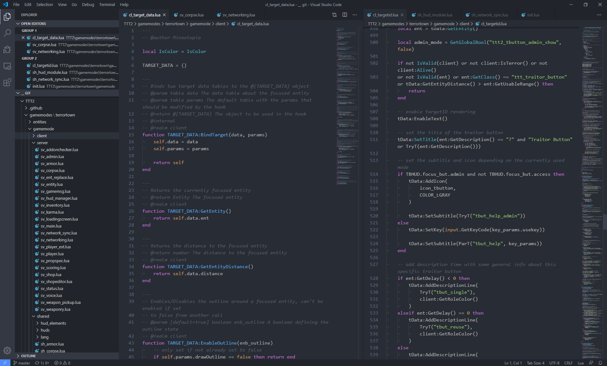
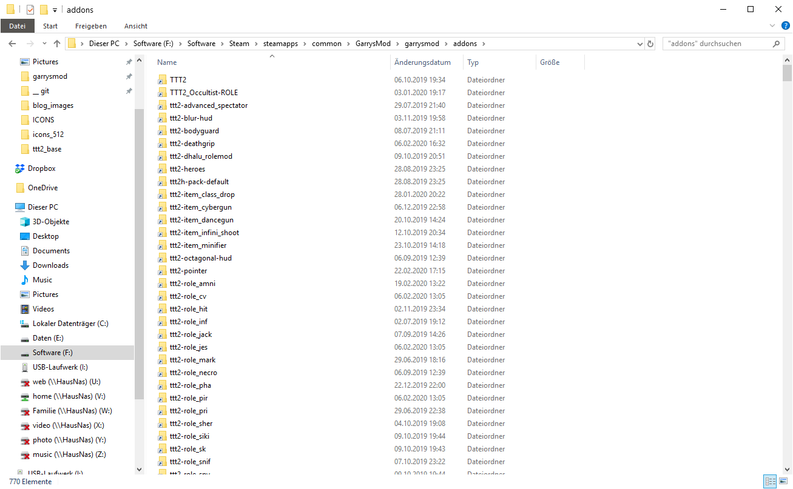

# Creating an Addon

## Workspace Setup

### Editor

The first step to get started with `lua` or any coding in general is the choice of an editor. I recommend the use of [Visual Studio Code](https://code.visualstudio.com/). However any editor can be used, even the default Microsoft editor works.

Additionally a [linter](https://en.wikipedia.org/wiki/Lint_(software)) is a nice to have tool to make sure the code is clean and works. The [glualint](https://marketplace.visualstudio.com/items?itemName=goz3rr.vscode-glualint) linter is perfect for the development of TTT addons since it combines normal lua linting with code completition of gmod functions (you have to follow the installation steps found in glualint description).

Additionally there are other lua addons available. All addons can be easily installed from inside VSCode itself with a single click.

*Ready to use editor with version control and gmod linting*

### Version Control

It is generally recommended to use [Git](https://git-scm.com/) for the management of projects. Especially if they are software related. We're using [GitHub](http://github.com/) as our hosting platform, however you are free to use any alternative that you like. GitHub also offers an easy to use client that is really beginner friendly. It is called [GitHub Desktop](https://desktop.github.com/).

*Easy to use graphical interface for GitHub*

Once your software is set up, you can create your first repository. Personally I do not like to create my local repository folders inside the garrysmod `addons/` folder since I prefer to have all my projects inside one folder to keep them organised. This creates a problem though, since it is really tedious to copy the contents from the `addons/` folder to your projects folder and back. [Symbolic links](https://en.wikipedia.org/wiki/Symbolic_link) are a neat solution for this. Personally on windows I use a graphical interface ([tutorial on setup and use](https://www.howtogeek.com/howto/16226/complete-guide-to-symbolic-links-symlinks-on-windows-or-linux/)), however it is up to your own preferences.

### Project Structure

All your addon files have to be placed into `GarrysMod/garrysmod/addons` and are automatically loaded when the game is started. Adding a new addon folder into this directory needs a restart of the game however.

*`addons/` folder with many addons as symbolic links inside*

See [this source](https://wiki.facepunch.com/gmod/Lua_Folder_Structure) for a detailed overview over the standard Garry's Mod project structure.

#### General Purpose Lua Files

#### Language

#### Items

#### Weapons

#### Roles

#### Classes

## Publishing your Addon

## Helpful Resources

* [The Garry's Mod wiki](https://wiki.facepunch.com/)
