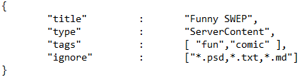
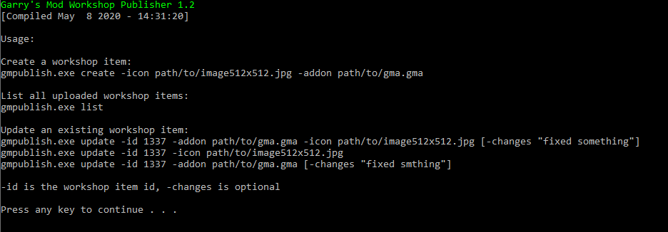

# Creating an Addon

## Workspace Setup

### Editor

The first step to get started with `lua` or any coding in general is the choice of an editor. I recommend the use of [Visual Studio Code](https://code.visualstudio.com/). However any editor can be used, even the default Microsoft editor works.

Additionally a [linter](<https://en.wikipedia.org/wiki/Lint_(software)>) is a nice to have tool to make sure the code is clean and works. The [glualint](https://marketplace.visualstudio.com/items?itemName=goz3rr.vscode-glualint) linter is perfect for the development of TTT addons since it combines normal lua linting with code completition of gmod functions (you have to follow the installation steps found in glualint description).

Additionally there are other lua addons available. All addons can be easily installed from inside VSCode itself with a single click.

???+ abstract "Ready to Use Editor With Version Control and GMod Linting"
    

### Version Control

It is generally recommended to use [Git](https://git-scm.com/) for the management of projects. Especially if they are software related. We're using [GitHub](http://github.com/) as our hosting platform, however you are free to use any alternative that you like. GitHub also offers an easy to use client that is really beginner friendly. It is called [GitHub Desktop](https://desktop.github.com/).

???+ abstract "Easy to Use Graphical Interface for GitHub"
    

Once your software is set up, you can create your first repository. Personally I do not like to create my local repository folders inside the garrysmod `addons/` folder since I prefer to have all my projects inside one folder to keep them organised. This creates a problem though, since it is really tedious to copy the contents from the `addons/` folder to your projects folder and back. [Symbolic links](https://en.wikipedia.org/wiki/Symbolic_link) are a neat solution for this. Personally on windows I use a graphical interface ([tutorial on setup and use](https://www.howtogeek.com/howto/16226/complete-guide-to-symbolic-links-symlinks-on-windows-or-linux/)), however it is up to your own preferences.

### Project Structure

All your addon files have to be placed into `GarrysMod/garrysmod/addons` and are automatically loaded when the game is started. Adding a new addon folder into this directory needs a restart of the game however.

???+ abstract "`addons/` Folder With Many Addons as Symbolic Links Inside"
    

See [this source](https://wiki.facepunch.com/gmod/Lua_Folder_Structure) for a detailed overview over the standard Garry's Mod project structure.

Besides the general Garry's Mod files, TTT2 also automatically loads different types of lua files from `lua/terrortown/`. Here's a list of the different types that can be used:

#### General Purpose Lua Files

While Garry's Mod provides its own autorun folder, this folder has the drawback that it is loaded independant from the selected gamemode. To prevent TTT2 addons from throwing errors in other gamemodes, TTT2 now has its own fileloader.

Files have to be placed in `lua/terrortown/autorun` to be loaded. However those files can't be placed directly inside this folder, but have to be placed in one of those three subfolders: `server/`, `client/`, `shared/`. Those files will be automatically included in their respective realm, therefore `AddCSLuaFile()` is not needed.

#### Language

Language files are a means to make translations for users easier by putting translations into their own folder and therefore keeping things cleans. Translations have to be placed in `lua/terrortown/lang/`. A more in depth documenation can be found in the [language support](/developers/content-creation/language-support.md) section.

#### Items

While TTT2 is still compatible with old TTT items, it has its own item loader. Items for TTT2 have to be placed inside `lua/terrortown/entities/items/`.

#### VSkins

VSkins are an easy way of changing the appearance of the vgui elements. They are automatically loaded if placed inside `lua/terrortown/vskins/`. A more in depth documenation can be found in the [vskin](/developers/content-creation/vskin.md) section.

#### Events

Every time someting happens in the game, an event is triggered. Those events can be used to modify the player score or add some information to the round end screen. Those files have to be placed in `lua/terrortown/events/`

#### Weapons

#### Roles

Custom role files have to be placed inside `lua/terrortown/entities/roles`. A more in depth documenation can be found in the [creating a role](/developers/content-creation/creating-a-role.md) section.

## Publishing your Addon

The most easy way of publishing your addon is with the [GMPublisher](https://github.com/WilliamVenner/gmpublisher). Follow their guide on how to use it. If you want to manually upload it or write a script to automate it, you can follow the description written here.

### Windows

In order to upload your addon to the Steam Workshop, you need to first compile it into a .gma file.

1.  Your addon file must contain an "addon.json" within the `<addon name>/` directory of your folder. This consists of a key:value pair table with information used by the Steam
    Workshop to create tags for uploads.  
    It should have a structure like this:

    ???+ abstract "Example addon.json file"
        

    Type is the category which this addon fits into best. One of:  
    "ServerContent", "gamemode", "map", "weapon", "vehicle", "npc", "tool", "effects", "model".

    Tags are what describes your addon best. Choose two of:  
    "fun", "roleplay", "scenic", "movie", "realism", "cartoon", "water", "comic", "build".

    Ignore is what files (you can use the \* as a wildcard to ignore file extensions - e.g. \*.txt) you dont want gmad to compile for use in the resulting .gma file.

1.  Navigate to your GarrysMod bin directory. (Usually in `Steam/steamapps/common/GarrysMod/bin`).

1.  Drag and drop your addon folder onto gmad.exe. This will generate a .gma file and place it into the same directory that your original folder came from.

    Alternatively you can use the cmd which gives you better error messages. Navigate to the GMod bin folder on the cmd and type gmad.exe, this gives you the gmad usage info. Input the directory to your addon folder and specify the output file directory and name.

    ???+ abstract "gmad help output"
        

1.  Navigate to the bin folder via cmd to use gmpublish.exe.

1.  Type `gmpublish.exe` to view usage information, input your icon and `*.gma` paths in their respective fields.

    ???+ abstract "gmpublish help output"
        

1.  You have now published your addon onto the steam workshop. Visit the addon in the workshop via the link that gmpublish gives you to add information to it and make it public.

## Helpful Resources

- [The Garry's Mod wiki](https://wiki.facepunch.com/)
