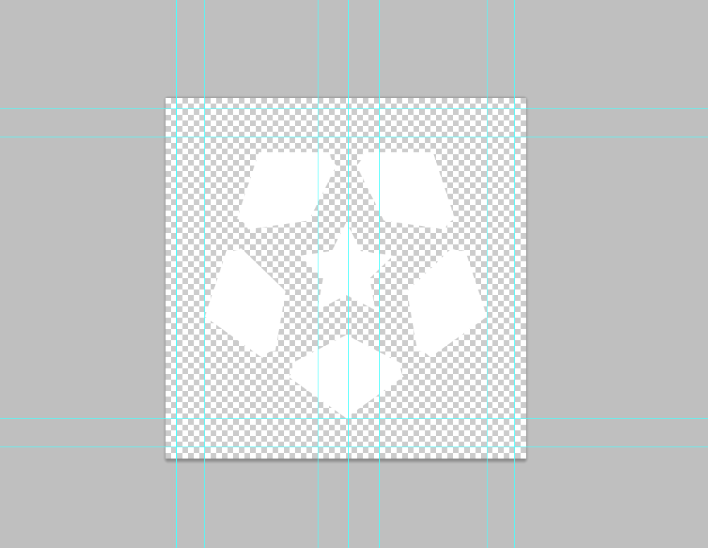
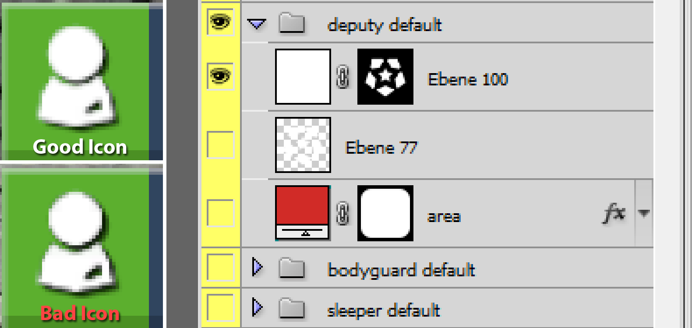
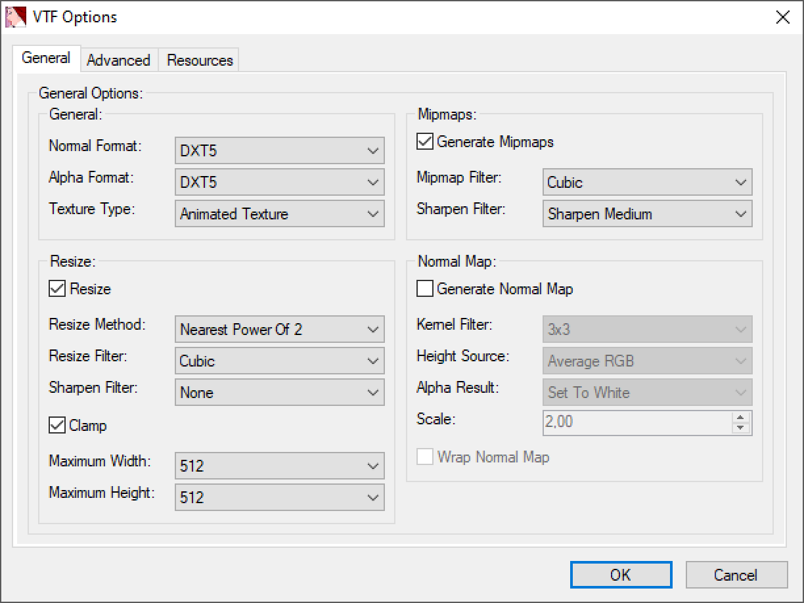

# Icon and Design Guideline

The design style of TTT2 builds on top of the TTT design and therefore inherits some of the original designguidelines. If in doubt always choose the more minimalistic design for TTT2.

>:bulb: With minor exeptions, icons for TTT2 should always be stored as a `*.vtf`.

## Icon Styles

### Simple Icons

Simple icons are used for role icons, status icons in the sidebar and many different areas in the game. They are always a plain white on a transparent background. Small icons (e.g. targetID inline icons) should have a resolution of **`64px x 64px`**, larger icons (e.g. role icons) should have a resolution of **`512px x 512px`**.

>:warning: These icons always have to be converted to a `*.vtf` since they need mipmapping for a clear display at different UI scales!

Additionally for both role and status icons, a decent padding should be set. There are no hard limits, however a padding of `10%` on each side is a good guideline.


*Example of the default padding used for role icons*

### Classic Icons

The style of the weapon and perk design is unchanged and [a template can be found here](http://ttt.badking.net/custom-weapon-guide). Additionally there are some information found in our [icon repository](https://github.com/TimGoll/ttt_addon_graphics/tree/master/reworked_shop/). Keep in mind that weapons should always use a blue background and perks a red background. This is done to prevent confusion while buying items in the shop.

1. Save the result as a `*.png` so that transparency isn't lost and convert it to a `*.vtf`.
2. The icons should have a resolution of **`64px x 64px`**
3. Perks are red, weapons are blue. Don't use any other colors!
4. The icon on should follow one of these two styles:
    1. an image with a small drop shadow by using the ["image_icon" style <sup>[photoshop style]</sup>](https://github.com/TTT-2/ttt_addon_graphics/blob/master/reworked_shop/styles/image_icon.asl)
    2. by using the ["flat icon" style <sup>[photoshop style]</sup>](https://github.com/TTT-2/ttt_addon_graphics/blob/master/reworked_shop/styles/flat_icon.asl) on a single colored icon

## Creating a VTF / VMT

Since TTT2 has dynamic HUD scaling, icons tend to be rendered at different sizes. To achieve good looking results, [mipmapping](https://en.wikipedia.org/wiki/Mipmap) should be used. [VTF Edit](https://developer.valvesoftware.com/wiki/VTFEdit), the tool of your coice supports mipmapping out of the box.

You start with creating an icon in the image manipulation software of your choice and export it as a `*.png` with transperency. Make sure you have the right resolution.

One thing to keep in mind are [problems with transparent areas](http://www.adriancourreges.com/blog/2017/05/09/beware-of-transparent-pixels/) for simple white icons. It caused us many headaches to figure out the problem described in the linked article. At least photoshop stores transparent areas as black with an opacity of `0`. That looks good on first glance, however the mipmapping procedure creates dark artefacts around the edges that are highly visible.


*Example of a good and bas icon with masks in Photoshop*

A solution to this problem in photoshop is to create a white layer with a mask in the shape of the icon. That way even transparent pixels are counted as white and a good mipmapping result is achieved.

Once the image is exported as a `*.png`, it has to be inported into VTF Edit. On import, a number of settings have to be set once.

>:bulb: Press `view -> mask` to show the transparent background.


*Page 1 of the VTF Options, page 2 and 3 can stay the way they are*

In the last step the file has to be exported as a `*.vtf` file. The associated `*.vmt` file can be exported as well. Alternatively it can be created by hand using this template:

```json
"UnlitGeneric"
{
	"$basetexture" "<path/to/vtf>"
	"$nocull" 1
	"$nodecal" 1
	"$nolod" 1
	"$translucent" 1
	"$vertexalpha" 1
	"$vertexcolor" 1
}
```

Both files should be placed in the same folder and have the same name.
