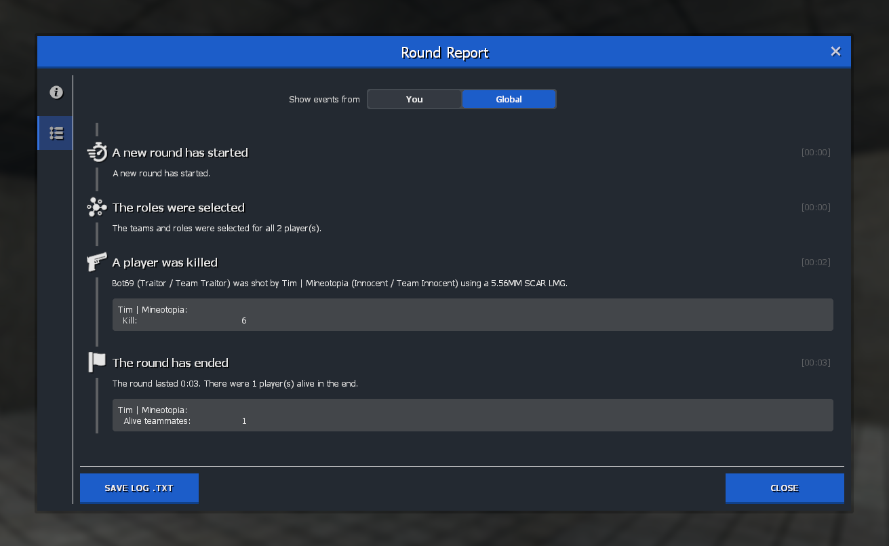

# Using the event system

The event system is a powerful feature of TTT2 that allows content creators to display rich event information in the round end screen, assign scores or add data to the log. In the following article it is explained how it can be used.

???+ abstract "Round end screen with events"
    

???+ note
    If you just plan on modifying the scoring of your role, check out the [role scoring variables](/developers/content-creation/creating-a-role.md) first.

## Registering an event

An event is registered by simply placing an event file in the event folder of your addon. The correct path is `lua/terrortown/events/`. Any name can be used, but it should be unique. A list of existing TTT2 events can be found [in the repository](https://github.com/TTT-2/TTT2/tree/master/lua/terrortown/events). A documentation of the event base can be found in the [API docs](https://api-docs.ttt2.neoxult.de/class/EVENT/none).

### Basic event

A basic event needs only the `Trigger(...)` function (which can have an arbitrary amount of parameters). However it is recommended to also define an `icon`, `title` and the `GetText()` function. `Serialize()` is recommended as well because it logs the event to the log file. `CalculateScore()` is used if the event should generate score.

???+ note
    The event name is derived from the file name and stored in a global variable that can be accessed with `EVENT_<EVENT_NAME>`.

    Custom defined language strings (`title`, ...) do not have to use the `<event_name>` notation, but it is recommended to do so.

```lua
if CLIENT then
    EVENT.icon = Material("path/to/material")
    EVENT.title = "title_event_<eventname>"

    function EVENT:GetText()
        -- each returned subtable is rendered as one paragraph
        return {
            {
                string = "desc_event_<eventname>",
                params = {
                    player = self.event.finder.nick,
                },
                translateParams = false
            },
            {
                -- ...
            }
        }
    end
end

if SERVER then
    -- this function is triggered when the event is triggered
    function EVENT:Trigger(finder)
        self:AddAffectedPlayers(
            {finder:SteamID64()},
            {finder:Nick()}
        )

        return self:Add({
            -- string indexed data can be added here
            finder = {
                nick = finder:Nick(),
                sid64 = finder:SteamID64()
            }
        })
    end

    -- this function is triggered to calculate the score
    function EVENT:CalculateScore()
        self:SetPlayerScore(self.event.finder.sid64, {
            score = 3
        })
    end
end

-- simple text to store in the log file
function EVENT:Serialize()
    return self.event.finder.nick .. " has done something."
end
```

The icon is a simple white on transparent graphic with a resolution of 512x512 and a few empty pixels all the way around. Check out the [icon and design guideline](/developers/content-creation/icon-and-design-guideline.md) to see how to create these icons.

#### Localization

There are a few strings that should be added to the localization file. The following is almost always needed:

```txt
title_event_<eventname> = "My cool event"
```

If the event has a description, the description should be localized as well. In our example it is a single line that has to be added:

```txt
desc_event_<eventname> = "{player} has done something."
```

If the event also grants a score, two more strings are needed. These identifiers are automatically generated:

```txt
tooltip_<event_name>_score = "My event: {score}"
<event_name>_score = "My event:"
```

[[Check out this really basic example]](https://github.com/TTT-2/ttt2-coffeecup/blob/master/lua/terrortown/events/coffeecup.lua)

### Inheriting

Once you understood the basic principle of these events, you can use inheritance to modify or extend existing events. This might be useful if you plan on overloading the kill event.

By default the event base is always `base_event`. This does not have to be specified as it is automatically assumed. If you want to inherit from a different existing event, just set the base accordingly. You can even call the parent functions with the `BaseClass` pointer.

[[Check out this example of a modified kill event]](https://github.com/TTT-2/ttt2-role_hit/blob/master/lua/terrortown/events/target_kill.lua)

## Triggering an event

If you've finnished your event and want to execute it, you have to run a single function: `events.Trigger()` ([docs](https://api-docs.ttt2.neoxult.de/module/events/none/server/events.Trigger)).

Our previuosly created event would be called like this:

```lua
events.Trigger(EVENT_<EVENT_NAME>, somePlayer)
```

## Networking

Event data is automatically networked from the server to the client after the round has ended. However not everything is synced. While there are multiple entries that are synced, you should only modify the `self.event` table if you want to add synced data. Data directly added to the class (e.g. `self.myData = xyz`) is **not** synced.

### Karma

Karma-changes are by default not synced per event to save networking resources.
If you still need to know karma changes at certain events use this:

```lua
function EVENT:ShouldKarmaChangeSynchronize()
    return true
end
```

???+ note
Synchronization is used in the finish-event to display the latest karma changes on roundendscreen.

## Cancel or replace an event

Once an event is triggered, a callback hook is run. If this hook returns false, the event is not added to the queue. This can be used to either remove events or replace them with your own.

```lua
---
-- This hook is called once an event occured, the data is processed
-- and it is about to be added. This hook can be used to modify the data
-- or to cancel the event by returning `false`.
-- @param string type The type of the event as in `EVENT_XXX`
-- @param table eventData The table with the event data
-- @return boolean Return false to cancel the addition of this event
-- @realm server
-- @hook
function GM:TTT2OnTriggeredEvent(type, eventData)

end
```

???+ note
    You shouldn't replace `EVENT_ROLECHANGE` because this event is used to generate the rolechange list in the round end screen.

[[Check out this example of a modified kill event that replaces the normal kill event]](https://github.com/TTT-2/ttt2-role_hit/blob/master/lua/terrortown/events/target_kill.lua)

## React to an event

There's also a secondary hook that is called after the event is successfully added to the event list. It can be used to work with this event or even add more data to the event.

```lua
---
-- This hook is called after the event was successfully added to the
-- eventmanager.
-- @param string type The type of the event as in `EVENT_XXX`
-- @param EVENT event The event that was added with all its functions
-- @realm server
-- @hook
function GM:TTT2AddedEvent(type, event)

end
```
