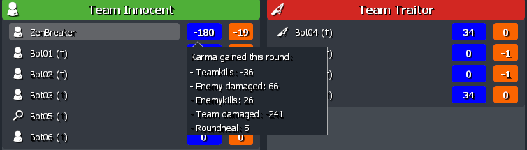

# Using Karma

The mysterious karma system is mostly untouched in TTT2, but karma can now be easily added or subtracted and those changes are shown at the roundendscreen.

???+ abstract "Round end screen with detailed Karma"


## Adding Karma

On the server you are now able to change karma directly with the global function and don't have to deal with internal structures.
This karma change gets applied to the base karma at the next round, before karma damage reduction calculations are done.

```lua
-- Player ply - Affected Player
-- Number amount - Amount of karma that gets changed, can be negative
-- String reason - It will be displayed in the roundendscreen as tooltip
--                 Use language localization or give it a short name
function KARMA.DoKarmaChange(ply, amount, reason)
```

???+ note
As an example the reason "karma_teamkill_tooltip" gets localized as seen in the picture at the top.

    [Check out how to work with language localization.](/developers/content-creation/language-support.md)

    ```txt
    karma_teamkill_tooltip = "Teamkills"
    ```
