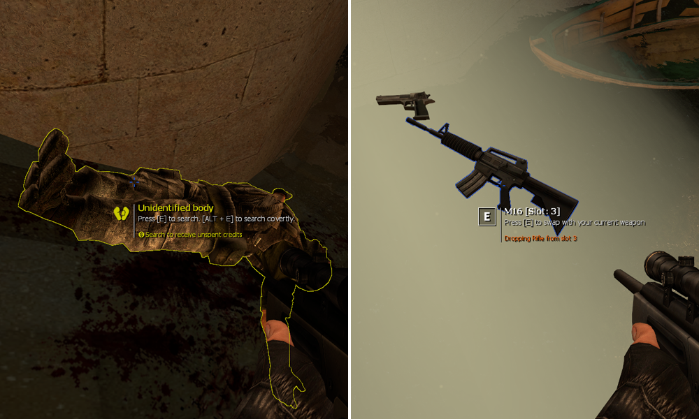

# Using TargetID

TargetID is the system that displays information while looking at entities. This system got completely overhauled for TTT2 and is now easily extendable by addons.

???+ abstract "TargetID Usage Examples"
    

## Adding Information

Adding or modifying information to the targetID element is done with a hook that is called every frame as long as the player is looking at a valid entity. This hook is called after internal information are added to the targetID element so that a external modification is possible.

```lua
hook.Add("TTTRenderEntityInfo", "hook_identifier", function(tData)
    -- do something
end)
```

In this hook, the `tData` object is provided. All the existing data can be accessed from there while new data can be added as well. A bunch of functions on this object exist that can be used to modify the data. A direct table modification on the raw data is also possible, but not recommended. 

Check out the [[reference]](https://github.com/TTT-2/TTT2/blob/master/gamemodes/terrortown/gamemode/client/cl_target_data.lua) to see what is possible.

## Modifying the Target

In some cases the targeted entity has to be modified. While this can be done in the rendering hook as well, a secondary hook is recommended. This hook is run before the rendering hook and therefore allows the modification of the entity reference before other addons add their rendering code.

```lua
hook.Add("TTTModifyTargetedEntity", "hook_identifier", function(ent, distance)
    -- do something and return the reference to the new ent
end)
```

Amongst other things his can be used to swap entites. See this example of the [identity disguiser](https://github.com/TTT-2/ttt2-wep_identity_disguiser/blob/master/gamemodes/terrortown/entities/weapons/weapon_ttt_identity_disguiser.lua)
