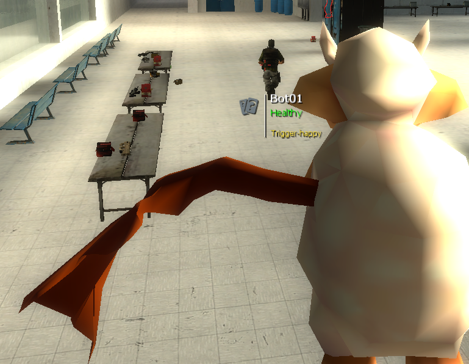

# Using TargetID

TargetID is the system that displays information while looking at entities. This system got completely overhauled for TTT2 and is now easily extendable by addons.

???+ abstract "TargetID Usage Examples"
    

## Adding Information

Adding or modifying information to the targetID element is done with a hook that is called every frame as long as the player is looking at a valid entity. This hook is called after internal information are added to the targetID element so that a external modification is possible.

```lua
hook.Add("TTTRenderEntityInfo", "hook_identifier", function(tData)
    -- do something
end)
```

In this hook, the `tData` object is provided. All the existing data can be accessed from there while new data can be added as well. A bunch of functions on this object exist that can be used to modify the data. A direct table modification on the raw data is also possible, but not recommended. 

Check out the [[reference]](https://github.com/TTT-2/TTT2/blob/master/gamemodes/terrortown/gamemode/client/cl_target_data.lua) to see what is possible.

## Modifying the Target

In some cases the targeted entity has to be modified. While this can be done in the rendering hook as well, a secondary hook is recommended. This hook is run before the rendering hook and therefore allows the modification of the entity reference before other addons add their rendering code.

```lua
hook.Add("TTTModifyTargetedEntity", "hook_identifier", function(ent, distance)
    -- do something and return the reference to the new ent
end)
```

Amongst other things his can be used to swap entites. See this example of the [identity disguiser](https://github.com/TTT-2/ttt2-wep_identity_disguiser/blob/master/gamemodes/terrortown/entities/weapons/weapon_ttt_identity_disguiser.lua)

## Redirecting remote view

If you want to see the correct targetID on a remote viewer, like a camera or remote controlled object, you need to modify the targeted entity you can see depending on the remote's position.

```lua
-- This function handles finding Entities by casting a ray from a point in a direction, filtering out certain entities
-- Use this in combination with the hook @GM:TTTModifyTargetedEntity to create your own Remote Camera with TargetIDs.
-- e.g. This is used in @GM:HUDDrawTargetID before drawing the TargetIDs. Use that code as example.
-- @note This finds the next Entity, that doesn't get filtered out and can get hit by a bullet, from a position in a direction.

-- @param vector pos Position of Ray Origin.
-- @param vector dir Direction of the Ray. Should be normalized.
-- @param table filter List of all @{Entity}s that should be filtered out.

-- @return entity The Entity that got found
-- @return number The Distance between the Origin and the Entity

-- @realm client
function targetid.FindEntityAlongView(pos, dir, filter)
```

By using the new targetID-library and a simple script you can do it like this in the above mentioned hook "TTTModifyTargetedEntity"

???+ abstract "TargetID on remote controlled entity"
    

```lua
-- Assuming this entity is assigned
local remoteEntity
local isRemoteControlled = false -- Set this to true, when being in remote-View

-- Enable TargetID when controlling the sheep
hook.Add("TTTModifyTargetedEntity", "remoteTargetId", function()
    if isRemoteControlled then
        return remoteTargetId(remoteEntity)
    end
end)

local function remoteTargetId(ent)
    local pos = ent:GetPos()
    local dir = ent:GetAngles():Forward()
    local filter = {ent} -- filters itself out, so you don't show your own targetID

    targetEnt, distance = targetid.FindEntityAlongView(pos, dir, filter)

    return targetEnt
end
```
