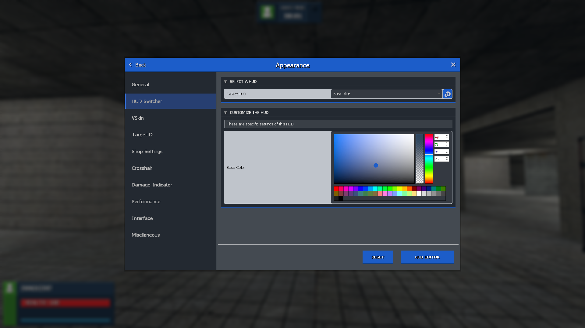

# VSkin

VSkins are skins applied to vgui (F1 menu, roundend menu, shop, ...) elements. Skins are simple tables that modify colors and sizes. Most colors used by the vskin system are automatically generated based on the colors inside of the vskin table.

???+ abstract "Example of the Dark VSkin"
    

## Creating a VSkin

VSkin files have to be located inside of `lua/terrortown/vskins/`. While filename should be unique, it doesn't represent the skin name shown ingame. It follows an example of the `ttt2_dark` vskin:

```lua
vskin.RegisterVSkin("dark_ttt2", {
	colors = {
		background = Color(40, 45, 52, 255),
		accent = Color(34, 93, 200, 255),
		accent_dark = Color(23, 67, 139, 255),
		scroll = Color(20, 30, 40, 255),
		shadow = Color(0, 0, 0, 100),
		screen = Color(10, 15, 20, 200),
		title_text = Color(255, 255, 255, 255)
	},
	params = {
		shadow_size = 4,
		header_height = 45,
		collapsable_height = 30,
		border_size = 3,
		corner_radius = 6
	}
})
```

All those values have to be set, the rendering will fail otherwise.
