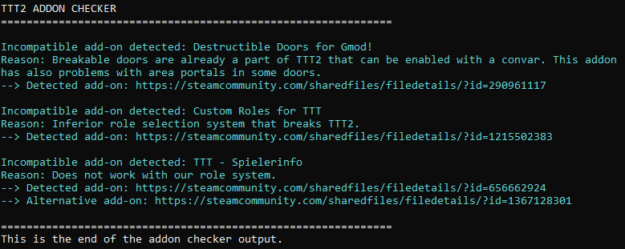

# Troubleshooting

## Common fixes
1. Check for incompatible addons using our addon checker, further information below. These addons may still work, but are not recommended and should be removed when troubleshooting a problem.
2. Reduce the amount of installed addons step by step e.g. removing half of them, then restarting the game to check for the error and keep dividing the addons to narrow down a possible buggy addon, that you can remove, in order to keep playing and in the best case you should send a bugreport to the developer, so that he can fix the error and improve his addon.
3. Make sure that you do **not** have installed the original version of any addon listed below:
    - [TTT Damagelogs](https://github.com/Tommy228/tttdamagelogs) - Please install Alf's patched version, which can be found [here](https://github.com/Alf21/tttdamagelogs). Otherwise this may cause issues like rounds not starting or special roles not being selected.
    - [Pointshop 1 / 2 TTT Role Control](https://www.gmodstore.com/market/view/ttt-role-control-traitorpass-and-detectivepass-pointshop-1-2) - This interferes with the role selection system of TTT2 and is currently unusable.
    - [TTT Spectator Deathmatch](https://github.com/Tommy228/TTT_Spectator_Deathmatch) - You can use the fixed version for TTT2 made by Nick & mexikoedi found [here](https://steamcommunity.com/sharedfiles/filedetails/?id=1997666028) instead.

## Addon checker
The integrated addon checker will check for known incompatible addons using a curated list and will inform you about many known incompatible addons and possible replacements. The output is printed to the server log / the console, when the gamemode loads. These addons may still work, but are **not recommended** and should be removed when troubleshooting a problem.

???+ abstract "Example Output Found in the Server Log"
    

## FAQ

### Q1: The HUD throws errors / is invisible.
It seems like you are using an incompatible addon on your server. We added an addon checker that lists many known incompatible addons in the server console upon server start. Additionally, it recommends an alternative in most cases. You may need to go to the very beginning of the server log to find it. It looks like this: 

### Q2: I want to sprint on shift without activating the team voice chat.
The sprint key is by default ++shift++, which is the same key as the team voice chat. As the team voice chat always used that key, this is still the intended default. However, if you want to change that key, you can always press ++f1++ and navigate to the `Bindings` section, where you can set a new key.

### Q3: I have an error, but it has spammed my console, so I can't copy it.
Please send us your full log. In many cases some errors are caused by previous errors. You can get the full log when you add `-condebug` to the GarrysMod start options in Steam. The log will be saved in `GarrysMod/garrysmod/console.log`. For further information see this [discussion](https://steamcommunity.com/app/4000/discussions/1/1698293068431221842/).

### Q4: The server does not work, there's an error with a 'TipIndex'!
This problem is most likely caused by another error that happened before. Please make sure to check the console / serverlog for possible errors that happened. Usually the first error is the most important one, as it will cause other things to break like a chain-reaction.

### Q5: Some ConVars in ULX do not save. What's wrong?
This could have many reasons. First, make sure that you shut down your server correctly since convars are only saved on server shutdown. Secondly make sure that you don't have the convars defined in your `server.cfg` file. At last, convars defined in the gamemode file are always overwritten by this file. Modify the file or define these convars in the `server.cfg` file for now, until this is reworked.

### Q6: My version is outdated, even though I am using the workshop version.  
This is a common steam caching problem. Try to verify your game files (Right click on Garry's Mod --> Properties --> Local files --> Verify integrity of game files).

### Q7: Weapon pickup only works in certain situations and only if I stand really close to the weapon.
This problem is caused by different weapon models for client and server. The most common cause is an outdated CS:S content pack on the client, while the server has new CS:S content mounted. There are two methods to get the latest CS:S content: Either buy and install CS:S from Steam or follow this [guide](https://steamcommunity.com/sharedfiles/filedetails/?id=1282064537).

### Q8: Player models get reset at death or in other situations.
This is because TTT2 has its own model system used by our roles for example. If you want to use your own system, set the convar `ttt_enforce_playermodel` to 0.

### Q9: When looking at players their names and info are displayed twice.
This is most likely caused by an addon that overrides Gamemode functions for `TargetID`, which is the system that shows information of objects, you are currently looking at. Usually this is caused by some "identity swapper" or "advanced disguiser" addons that do this. Remove them to fix the issue.
